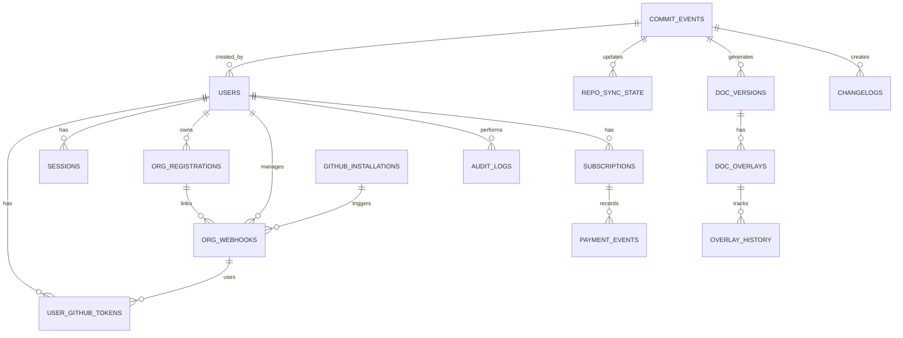

# 📊 LEKHAK AI - DATABASE SCHEMA DIAGRAM

## Complete Schema Visualization



---

## Table Relationship Details

### **USER MANAGEMENT LAYER**

```
┌─────────────────────────────────────────────────────────────┐
│                        USERS                                │
├─────────────────────────────────────────────────────────────┤
│ id (PK)                                                     │
│ github_id (UNIQUE)                                          │
│ email (UNIQUE)                                              │
│ username (UNIQUE)                                           │
│ name                                                        │
│ avatar_url                                                  │
│ plan (free/pro/enterprise)                                  │
│ is_active                                                   │
│ created_at, updated_at                                      │
└─────────────────────────────────────────────────────────────┘
        │                    │                    │
        ├────────────────────┼────────────────────┤
        ▼                    ▼                    ▼
┌──────────────────┐ ┌──────────────┐ ┌──────────────────┐
│ USER_GITHUB_     │ │  SESSIONS    │ │ ORG_             │
│ TOKENS           │ │              │ │ REGISTRATIONS    │
├──────────────────┤ ├──────────────┤ ├──────────────────┤
│ id (PK)          │ │ id (PK)      │ │ id (PK)          │
│ user_id (FK)     │ │ user_id (FK) │ │ user_id (FK)     │
│ github_token     │ │ access_token │ │ org_id           │
│ token_id (UNIQUE)│ │ refresh_token│ │ registered_at    │
│ is_active        │ │ expires_at   │ │ UNIQUE(user,org) │
│ created_at       │ │ ip_address   │ │                  │
│                  │ │ user_agent   │ │                  │
└──────────────────┘ └──────────────┘ └──────────────────┘
```

---

### **ORGANIZATION MANAGEMENT LAYER**

```
┌──────────────────────────────────────────────────────────────┐
│              ORG_REGISTRATIONS                               │
│  (Maps which user owns which organization)                   │
├──────────────────────────────────────────────────────────────┤
│ id (PK)                                                      │
│ user_id (FK) → users.id                                      │
│ org_id (VARCHAR)                                             │
│ registered_at                                                │
│ UNIQUE(user_id, org_id)                                      │
└──────────────────────────────────────────────────────────────┘
        │
        ▼
┌──────────────────────────────────────────────────────────────┐
│              ORG_WEBHOOKS                                    │
│  (Webhook config + token mapping)                            │
├──────────────────────────────────────────────────────────────┤
│ id (PK)                                                      │
│ user_id (FK) → users.id                                      │
│ org_id (VARCHAR)                                             │
│ webhook_secret                                               │
│ github_token_id (FK) → user_github_tokens.token_id           │
│ created_at, updated_at                                       │
│ UNIQUE(user_id, org_id)                                      │
└──────────────────────────────────────────────────────────────┘
        │
        ▼
┌──────────────────────────────────────────────────────────────┐
│           GITHUB_INSTALLATIONS                               │
│  (GitHub App installation tracking)                          │
├──────────────────────────────────────────────────────────────┤
│ id (PK)                                                      │
│ installation_id (UNIQUE)                                     │
│ org_id (VARCHAR)                                             │
│ app_id                                                       │
│ created_at                                                   │
└──────────────────────────────────────────────────────────────┘
```

---

### **EVENT PROCESSING LAYER**

```
┌──────────────────────────────────────────────────────────────┐
│              COMMIT_EVENTS                                   │
│  (Core event queue - all GitHub push events)                 │
├──────────────────────────────────────────────────────────────┤
│ id (PK)                                                      │
│ repo_id (VARCHAR)                                            │
│ commit_sha (VARCHAR)                                         │
│ parent_sha (TEXT[])                                          │
│ author_name, author_email                                    │
│ timestamp                                                    │
│ branch                                                       │
│ files_changed (JSONB)                                        │
│ commit_message                                               │
│ push_id                                                      │
│ source (github)                                              │
│ metadata (JSONB)                                             │
│ user_id (FK) → users.id                                      │
│ org_id (VARCHAR)                                             │
│ github_token_id (FK)                                         │
│ webhook_secret                                               │
│ installation_id                                              │
│ processed (BOOLEAN)                                          │
│ retry_count (INTEGER)                                        │
│ error_message (TEXT)                                         │
│ created_at, updated_at                                       │
│ INDEX: org_id, user_id, processed                            │
└──────────────────────────────────────────────────────────────┘
        │                           │
        ▼                           ▼
┌──────────────────────┐  ┌──────────────────────┐
│   REPO_SYNC_STATE    │  │   DOC_VERSIONS       │
│ (Last processed SHA) │  │ (Generated docs)     │
├──────────────────────┤  ├──────────────────────┤
│ id (PK)              │  │ id (PK)              │
│ org_id               │  │ repo_id              │
│ repo_id              │  │ commit_sha           │
│ last_processed_sha   │  │ version_number       │
│ last_processed_at    │  │ architecture_doc     │
│ created_at, updated  │  │ workflow_doc         │
│ UNIQUE(org, repo)    │  │ api_doc              │
└──────────────────────┘  │ summary_doc          │
                          │ quality_score        │
                          │ generated_at         │
                          │ created_at           │
                          └──────────────────────┘
                                  │
                                  ▼
                          ┌──────────────────────┐
                          │   DOC_OVERLAYS       │
                          │ (Annotations)        │
                          ├──────────────────────┤
                          │ id (PK)              │
                          │ doc_version_id (FK)  │
                          │ overlay_type         │
                          │ content (JSONB)      │
                          │ created_at           │
                          └──────────────────────┘
```

---

### **AUDIT & BILLING LAYER**

```
┌──────────────────────────────────────────────────────────────┐
│              AUDIT_LOGS                                      │
│  (User action tracking)                                      │
├──────────────────────────────────────────────────────────────┤
│ id (PK)                                                      │
│ user_id (FK) → users.id                                      │
│ action (VARCHAR)                                             │
│ ip_address                                                   │
│ metadata (JSONB)                                             │
│ created_at                                                   │
└──────────────────────────────────────────────────────────────┘

┌──────────────────────────────────────────────────────────────┐
│           SUBSCRIPTIONS                                      │
│  (User subscription status)                                  │
├──────────────────────────────────────────────────────────────┤
│ id (PK)                                                      │
│ user_id (FK) → users.id                                      │
│ plan_id (free/pro/enterprise)                                │
│ status (active/cancelled)                                    │
│ current_period_start                                         │
│ current_period_end                                           │
│ created_at, updated_at                                       │
└──────────────────────────────────────────────────────────────┘
        │
        ▼
┌──────────────────────────────────────────────────────────────┐
│           PAYMENT_EVENTS                                     │
│  (Payment transaction history)                               │
├──────────────────────────────────────────────────────────────┤
│ id (PK)                                                      │
│ subscription_id (FK)                                         │
│ amount (DECIMAL)                                             │
│ currency (VARCHAR)                                           │
│ status (succeeded/failed)                                    │
│ stripe_event_id                                              │
│ created_at                                                   │
└──────────────────────────────────────────────────────────────┘
```

---

## Data Flow Diagram

### **Webhook Reception → Event Storage → Processing**

```
┌─────────────────────────────────────────────────────────────┐
│ GITHUB SENDS WEBHOOK                                        │
│ POST /webhook                                               │
│ {repository: {full_name: "org/repo"}, commits: [...]}        │
└─────────────────────────────────────────────────────────────┘
                            ↓
┌─────────────────────────────────────────────────────────────┐
│ MAIN.PY: handle_webhook()                                   │
│ 1. Verify signature                                         │
│ 2. Parse payload                                            │
│ 3. Call webhook_multi_org()                                 │
└─────────────────────────────────────────────────────────────┘
                            ↓
┌─────────────────────────────────────────────────────────────┐
│ WEBHOOK_MULTI_ORG.PY: get_org_context()                     │
│ 1. Extract org from "org/repo"                              │
│ 2. Query org_webhooks → org_registrations → commit_events   │
│ 3. Find user_id and github_token_id                         │
└─────────────────────────────────────────────────────────────┘
                            ↓
┌─────────────────────────────────────────────────────────────┐
│ CREATE CommitEvent OBJECT                                   │
│ {repo_id, commit_sha, user_id, org_id, ...}                 │
└─────────────────────────────────────────────────────────────┘
                            ↓
┌─────────────────────────────────────────────────────────────┐
│ COMMIT_BUS.PY: store_event()                                │
│ INSERT INTO commit_events (...)                             │
└─────────────────────────────────────────────────────────────┘
                            ↓
┌─────────────────────────────────────────────────────────────┐
│ RETURN 200 OK TO GITHUB                                     │
│ (Async processing begins)                                   │
└─────────────────────────────────────────────────────────────┘
                            ↓
┌─────────────────────────────────────────────────────────────┐
│ EVENT CONSUMER: process_events()                            │
│ Poll commit_events WHERE processed=false                    │
└─────────────────────────────────────────────────────────────┘
                            ↓
┌─────────────────────────────────────────────────────────────┐
│ FOR EACH EVENT:                                             │
│ 1. Get user's GitHub token from user_github_tokens          │
│ 2. Clone repository                                         │
│ 3. Call smart_processor                                     │
│ 4. Generate docs                                            │
│ 5. Commit to GitHub                                         │
│ 6. Store in doc_versions                                    │
│ 7. Update repo_sync_state                                   │
│ 8. Mark commit_events.processed = true                      │
└─────────────────────────────────────────────────────────────┘
```

---

## Query Patterns

### **Pattern 1: Find User's Organizations**
```sql
SELECT org_id FROM org_registrations WHERE user_id = $1;
```

### **Pattern 2: Find Organization Owner**
```sql
SELECT user_id FROM org_registrations WHERE org_id = $1 LIMIT 1;
```

### **Pattern 3: Get GitHub Token for Organization**
```sql
SELECT ugt.github_token
FROM org_webhooks ow
JOIN user_github_tokens ugt ON ow.github_token_id = ugt.token_id
WHERE ow.org_id = $1;
```

### **Pattern 4: Find Pending Events**
```sql
SELECT * FROM commit_events 
WHERE processed = false 
ORDER BY created_at ASC 
LIMIT 10;
```

### **Pattern 5: Get Last Processed Commit**
```sql
SELECT last_processed_sha FROM repo_sync_state
WHERE org_id = $1 AND repo_id = $2;
```

### **Pattern 6: Store Documentation**
```sql
INSERT INTO doc_versions (repo_id, commit_sha, architecture_doc, ...)
VALUES ($1, $2, $3, ...);
```

---

## Index Strategy

```sql
-- User lookups
CREATE INDEX idx_users_github_id ON users(github_id);
CREATE INDEX idx_users_username ON users(username);

-- Token lookups
CREATE INDEX idx_user_github_tokens_user_id ON user_github_tokens(user_id);
CREATE INDEX idx_user_github_tokens_token_id ON user_github_tokens(token_id);

-- Organization lookups
CREATE INDEX idx_org_registrations_user_id ON org_registrations(user_id);
CREATE INDEX idx_org_registrations_org_id ON org_registrations(org_id);
CREATE INDEX idx_org_webhooks_org_id ON org_webhooks(org_id);

-- Event lookups
CREATE INDEX idx_commit_events_org_id ON commit_events(org_id);
CREATE INDEX idx_commit_events_user_id ON commit_events(user_id);
CREATE INDEX idx_commit_events_processed ON commit_events(processed);
CREATE INDEX idx_commit_events_created_at ON commit_events(created_at DESC);

-- Documentation lookups
CREATE INDEX idx_doc_versions_repo_id ON doc_versions(repo_id);
CREATE INDEX idx_doc_versions_commit_sha ON doc_versions(commit_sha);

-- Session lookups
CREATE INDEX idx_sessions_user_id ON sessions(user_id);
CREATE INDEX idx_sessions_expires_at ON sessions(expires_at);

-- Sync state lookups
CREATE INDEX idx_repo_sync_state_org_repo ON repo_sync_state(org_id, repo_id);
```

---

## Summary

**Total Tables:** 21 (should be 13 after cleanup)  
**Critical Tables:** 8  
**Optional Tables:** 5  
**Unused Tables:** 8  

**Key Relationships:**
- Users → Organizations (via org_registrations)
- Organizations → Webhooks (via org_webhooks)
- Webhooks → Tokens (via user_github_tokens)
- Events → Documentation (via commit_events → doc_versions)

**Performance Considerations:**
- Add indexes on frequently queried columns
- Use connection pooling
- Implement caching for org lookups
- Archive old events after 90 days
