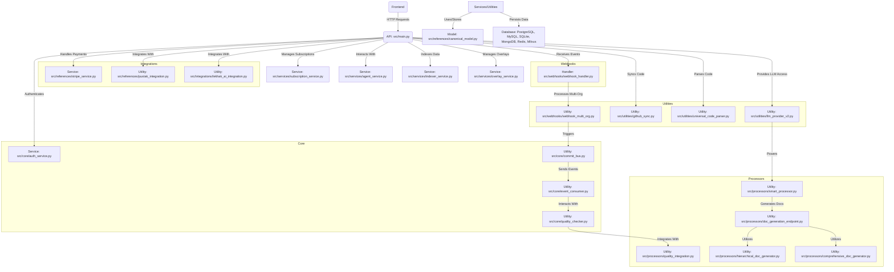

# Architecture v10.6

## System Overview

The `docai_smart_9u0jf3i3` system is a multi-component application designed to process and generate documentation, integrate with external services, and manage user interactions. It features an `api` component, a `database` component, and a `frontend` component, orchestrated by a `core` layer. Key interactions revolve around webhook processing, authentication, and various utility and service modules.

## Actual Components Found

The codebase `docai_smart_9u0jf3i3` consists of distinct services, handlers, data models, and various utility modules.

### Services
-   **auth_service**: Service module handling authentication functionality. (Path: `src/core/auth_service.py`)
-   **stripe_service**: Service module handling Stripe payment functionality. (Path: `src/references/stripe_service.py`)
-   **subscription_service**: Service module handling subscription management functionality. (Path: `src/services/subscription_service.py`)
-   **agent_service**: Service module handling agent-specific functionality. (Path: `src/services/agent_service.py`)
-   **indexer_service**: Service module handling data indexing functionality. (Path: `src/services/indexer_service.py`)
-   **overlay_service**: Service module handling overlay functionality. (Path: `src/services/overlay_service.py`)

### Handlers
-   **webhook_handler**: Handler for webhook operations. (Path: `src/webhooks/webhook_handler.py`)

### Models/Schemas
-   **canonical_model**: Data model/schema for canonical data representation. (Path: `src/references/canonical_model.py`)

### Utilities
-   **main**: Utility functions for the main application entry point, including API configuration and event processing. (Path: `src/main.py`)
-   **commit_bus**: Utility functions for a commit event bus. (Path: `src/core/commit_bus.py`)
-   **quality_checker**: Utility functions for checking quality. (Path: `src/core/quality_checker.py`)
-   **event_consumer**: Utility functions for consuming events. (Path: `src/core/event_consumer.py`)
-   **pustak_integration**: Utility functions for integration with Pustak. (Path: `src/references/pustak_integration.py`)
-   **lekhak_ai_integration**: Utility functions for integration with Lekhak AI. (Path: `src/integrations/lekhak_ai_integration.py`)
-   **universal_code_parser**: Utility functions for parsing various programming languages. (Path: `src/utilities/universal_code_parser.py`)
-   **github_sync**: Utility functions for synchronizing with GitHub. (Path: `src/utilities/github_sync.py`)
-   **llm_provider_v2**: Utility functions for interacting with Large Language Model (LLM) providers (version 2). (Path: `src/utilities/llm_provider_v2.py`)
-   **doc_generation_endpoint**: Utility functions for a documentation generation endpoint. (Path: `src/processors/doc_generation_endpoint.py`)
-   **hierarchical_doc_generator**: Utility functions for generating hierarchical documentation. (Path: `src/processors/hierarchical_doc_generator.py`)
-   **smart_processor**: Utility functions for smart processing tasks. (Path: `src/processors/smart_processor.py`)
-   **quality_integration**: Utility functions for quality integration processes. (Path: `src/processors/quality_integration.py`)
-   **comprehensive_doc_generator**: Utility functions for generating comprehensive documentation. (Path: `src/processors/comprehensive_doc_generator.py`)
-   **webhook_multi_org**: Utility functions for multi-organization webhook processing. (Path: `src/webhooks/webhook_multi_org.py`)

## Actual Technology Stack

### Core Technologies
-   **Languages**: py, js, ts
-   **Frameworks**: FastAPI (inferred from `fastapi` dependency in `requirements.txt` and `src/main.py`'s role in API config)
-   **Database**: PostgreSQL, MySQL, SQLite, MongoDB, Redis, Milvus
-   **Deployment**: Docker, Kubernetes, AWS, GCP, Azure, Heroku, Vercel, Netlify

### Key Dependencies
The project relies on the following key dependencies:
-   `fastapi`
-   `uvicorn`
-   `PyJWT`
-   `PyGithub`
-   `python-dotenv`
-   `python-dateutil`
-   `google-generativeai`
-   `groq`
-   `openai`
-   `requests`
-   `gitpython`
-   `asyncpg==0.29.0` (for Commit Bus)
-   `pymilvus==2.3.3` (for RAG System)
-   `sentence-transformers` (for local embeddings)
-   `pydantic==2.5.0`
-   `aiolimiter==1.1.0`

## Design Patterns Detected
-   Dependency Injection
-   Factory Pattern
-   Observer Pattern
-   Singleton Pattern
-   Repository Pattern
-   MVC Pattern
-   Strategy Pattern
-   Decorator Pattern
-   Command Pattern
-   Adapter Pattern
-   Facade Pattern
-   Proxy Pattern
-   Chain of Responsibility
-   Template Method
-   State Pattern
-   Composite Pattern
-   Iterator Pattern
-   Mediator Pattern
-   Memento Pattern
-   Flyweight Pattern

## Current Architecture

The `docai_smart_9u0jf3i3` system is built around a Python backend, primarily using `FastAPI` as its web framework, as evidenced by `src/main.py` handling API configuration and the `fastapi` dependency. The architecture is modular, separating concerns into `services`, `handlers`, `models`, and `utilities`.

`src/main.py` serves as the central entry point for the API, handling incoming HTTP requests, CORS configuration, and coordinating with various backend components. It also plays a critical role in processing webhook events.

The `core` directory (`src/core`) houses fundamental components like `auth_service` for user authentication, `commit_bus` for event messaging, `quality_checker` for code quality, and `event_consumer` for processing these events.

Specialized business logic is encapsulated within `services` such as `subscription_service`, `agent_service`, `indexer_service`, and `overlay_service`. Integrations with external systems are managed by `stripe_service`, `pustak_integration`, and `lekhak_ai_integration`.

Webhook handling is a significant aspect, with `webhook_handler` (in `src/webhooks`) dispatching events and `webhook_multi_org` providing utilities for multi-organizational context retrieval and processing.

Data persistence is flexible, supporting `PostgreSQL`, `MySQL`, `SQLite`, `MongoDB`, and `Redis` for general data, and `Milvus` specifically for vector similarity search, likely supporting a RAG (Retrieval Augmented Generation) system mentioned in dependencies. The `canonical_model` in `src/references` provides a consistent data schema across the application.

AI and code processing capabilities are provided through utilities like `llm_provider_v2` for interacting with various LLMs, `universal_code_parser` for code analysis, and `github_sync` for source code management. The system includes multiple document generation utilities such as `doc_generation_endpoint`, `hierarchical_doc_generator`, and `comprehensive_doc_generator`, often coordinated by `smart_processor`.

The detected `frontend`, `api`, `database`, and `core` components indicate a typical web application structure where the `frontend` interacts with the `api` layer (powered by `src/main.py` and services), which in turn leverages `core` components and `database` storage.

## Data Flow

1.  **Client Interaction**: A `frontend` client initiates requests to the `api` (e.g., `src/main.py`).
2.  **Authentication**: If authentication is required, requests go through `src/core/auth_service.py` (`login_and_create_jwt`) which authenticates the user and returns tokens, potentially including a `github_token`.
3.  **API Routing**: `src/main.py` routes requests to appropriate `services` (e.g., `subscription_service`, `agent_service`) or `utilities` (e.g., `doc_generation_endpoint`).
4.  **Webhook Events**: External systems (e.g., GitHub) send webhook events to endpoints exposed by `src/main.py`. These events are processed by `src/webhooks/webhook_handler.py` which uses `src/webhooks/webhook_multi_org.py` to retrieve organization-specific context and user attribution.
5.  **Internal Eventing**: Processed webhook events or internal actions might generate events that are pushed onto the `src/core/commit_bus.py` and subsequently consumed by `src/core/event_consumer.py`.
6.  **Data Processing**: Services and utilities perform their functions:
    *   `src/utilities/universal_code_parser.py` parses code.
    *   `src/utilities/github_sync.py` interacts with GitHub.
    *   `src/utilities/llm_provider_v2.py` sends prompts to and receives responses from LLMs, potentially orchestrated by `src/processors/smart_processor.py`.
    *   `src/processors/doc_generation_endpoint.py`, `src/processors/hierarchical_doc_generator.py`, and `src/processors/comprehensive_doc_generator.py` consume processed data to generate documentation.
7.  **Quality Checks**: `src/core/quality_checker.py` and `src/processors/quality_integration.py` assess outputs or processes.
8.  **Data Persistence**: Services interact with the `database` component (PostgreSQL, Milvus, etc.) to store and retrieve data, often adhering to the `src/references/canonical_model.py` schema.

## Recent Changes Impact

The recent changes in v10.6, specifically titled "Enhance Webhook Processing and Secure CORS Configuration," have a significant impact on the security, robustness, and core functionality related to webhooks and multi-organization support.

1.  **Enhanced Security (CORS)**: The `CORSMiddleware` configuration in `src/main.py` has been tightened from `["*"]` to a specific list of local development/testing origins. This directly impacts how client applications (the `frontend` component) can interact with the `api`, significantly reducing the attack surface by preventing unauthorized cross-origin requests.
2.  **Improved Authentication Response**: `src/core/auth_service.py`'s `login_and_create_jwt` now includes the `github_token` in its successful response. This streamlines operations for clients, as the `github_token` is immediately available post-login for `github_sync` or other GitHub-related functionalities without additional lookups.
3.  **Robust Multi-Org Webhook Event Processing**:
    *   The `process_commit_event` logic in `src/main.py` has been updated. It now includes fallback logic to derive `user_id` from the `org_registrations` table if the `webhook_context` lacks it. This ensures commit events are correctly attributed to users, improving `data_consistency` for multi-organization scenarios.
    *   The `get_org_context_from_repo` utility in `src/webhooks/webhook_multi_org.py` has been enhanced. It now attempts to find `user_id` and `org_id` in `org_registrations` and then `token_id` from `user_github_tokens` if the context is not directly found in `org_webhooks`. This provides a more resilient lookup for incoming webhook events.
4.  **Comprehensive Webhook Registration**: The `register_webhook` endpoint in `src/main.py` now performs a more thorough registration. Beyond just `org_registrations`, it explicitly inserts/updates records in the `org_webhooks` table, including fetching the `token_id` from `user_github_tokens`. This ensures that `org_webhooks` contains all necessary context (user_id, org_id, webhook_secret, github_token_id) from the outset, which is crucial for the subsequent robust processing of multi-org webhook events.

In summary, these changes make the `api` (specifically the `src/main.py` entry point) more secure regarding CORS, and significantly enhance the `multi_org_support` capabilities, `authentication` flow, and `data_consistency` of the webhook system by improving event attribution and registration processes, directly impacting `src/core/auth_service.py`, `src/main.py`, and `src/webhooks/webhook_multi_org.py`.