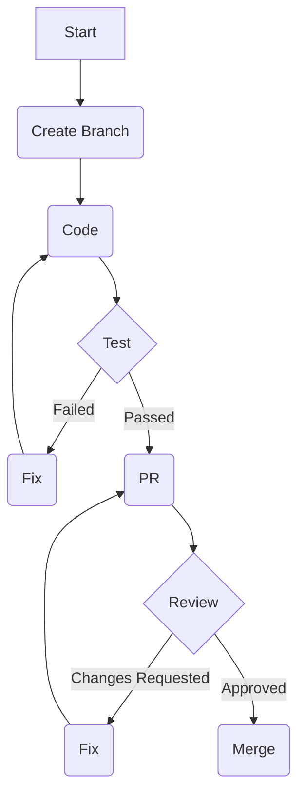

# Workflow v3.1

## Reason for New Version:
This new version, v3.1, is being introduced to provide updated and comprehensive workflow documentation, especially in light of recent significant improvements to the architecture documentation. While no direct process changes have been implemented, the enhanced documentation requires a re-evaluation and formalization of the development and deployment processes to reflect improved clarity and understanding.

## Development Workflow

### Setup Process
The setup process for this project focuses on preparing a local development environment to ensure all dependencies are met and the project can be run and tested effectively.

1.  **Environment Setup and Configuration:**
    *   **Operating System:** Ensure a compatible OS (Linux, macOS, Windows Subsystem for Linux recommended).
    *   **Python:** Install Python 3.8+ (check `requirements.txt` for exact version compatibility).
    *   **Virtual Environment:** Create and activate a Python virtual environment to isolate project dependencies.
        ```bash
        python3 -m venv .venv
        source .venv/bin/activate # On Windows: .venv\Scripts\activate
        ```
    *   **Configuration Files:** If applicable, copy `config.example.py` to `config.py` and populate with local environment-specific settings (e.g., API keys, database URLs).
2.  **Dependency Installation:**
    *   Install all required project dependencies using pip.
        ```bash
        pip install -r requirements.txt
        ```
3.  **Development Environment Preparation:**
    *   **IDE Setup:** Configure your preferred Integrated Development Environment (IDE) (e.g., VS Code, PyCharm) to use the project's virtual environment.
    *   **Pre-commit Hooks (If any):** Install and activate any pre-commit hooks for code quality checks. (No specific hooks identified in `WORKFLOW ANALYSIS`, so this is a general placeholder.)
    *   **Initial Run/Smoke Test:** Run basic commands to ensure the setup is functional.
        ```bash
        python main.py --help # Or any other entry point
        ```

### Development Process (with diagram)
The development process is iterative and follows a standard branching model, prioritizing code review before integration into the main codebase.



**Detailed Steps:**
1.  **Start:** A new feature, bug fix, or enhancement is identified.
2.  **Create Branch:** Developers create a new feature branch from `main` (e.g., `feature/my-new-feature`, `bugfix/issue-123`).
    ```bash
    git checkout main
    git pull origin main
    git checkout -b feature/my-new-feature
    ```
3.  **Code:** Implement the changes, following established coding standards and design patterns. Refer to the **Enhanced Architecture Documentation** for guidance on design, data flow, security, error handling, and performance.
4.  **Test:**
    *   **Local Unit/Integration Tests:** Run all relevant local tests to verify functionality and prevent regressions.
        ```bash
        pytest # Or equivalent test command
        ```
    *   **Manual Testing:** Perform manual tests to ensure the application behaves as expected in a local environment.
    *   **Debugging:** If tests fail or issues are found, debug and identify the root cause.
5.  **Fix (Loop 1):** If tests fail, return to the coding stage to implement necessary fixes.
6.  **Pull Request (PR):** Once local testing is successful, create a Pull Request (PR) to merge the feature branch into `main`. Provide a clear title, detailed description, and link to any related issues.
7.  **Review:**
    *   **Code Review:** Other developers review the code for correctness, adherence to standards, potential issues, and alignment with the architecture. The **Enhanced Architecture Documentation** serves as a critical reference for reviewers.
    *   **Feedback:** Reviewers provide constructive feedback and suggest changes.
8.  **Fix (Loop 2):** If changes are requested, implement the feedback, commit the changes, and push them to the feature branch. The PR will automatically update.
9.  **Merge:** Once the PR is approved by the required number of reviewers, the feature branch is merged into `main`. The feature branch can then be deleted.
    ```bash
    git checkout main
    git pull origin main
    git merge feature/my-new-feature # Or use GitHub/GitLab UI merge
    git branch -d feature/my-new-feature
    ```

### Code Review Process
The code review process is a critical quality gate, ensuring code quality, maintainability, and architectural integrity.

*   **Review Guidelines and Standards:**
    *   All code must adhere to PEP 8 for Python.
    *   Follow established design patterns and architectural principles outlined in the **Enhanced Architecture Documentation**.
    *   Ensure proper error handling, logging, and security considerations are met.
    *   Code should be clear, concise, well-documented (docstrings, comments where necessary), and easy to understand.
    *   Consider testability and the addition of new tests for new functionality.
*   **Approval Requirements and Process:**
    *   Each Pull Request requires at least one (or two for critical changes) approval from a designated senior developer or team lead.
    *   Reviewers must indicate approval explicitly in the PR system.
    *   Changes requested must be addressed by the author before re-requesting a review or receiving final approval.
*   **Quality Gates and Checks:**
    *   **Automated Checks (if any):** If linters (e.g., Black, Flake8), static analyzers (e.g., Pylint), or security scanners are configured as pre-commit hooks, they serve as initial quality gates.
    *   **Test Coverage:** While not enforced by an automated CI/CD, developers are encouraged to maintain high test coverage for their changes.
    *   **Architectural Compliance:** Reviewers pay close attention to whether the changes align with the documented architecture, data flow, and design patterns.

## Deployment Workflow

**NOTE:** As indicated by `has_ci_cd: false`, there is no formal CI/CD pipeline in place. All deployment steps are currently executed manually or via ad-hoc scripts. This emphasizes the need for meticulous adherence to these documented procedures.

### Development Deployment
Deployment to a development environment is typically done for integration testing, user acceptance testing (UAT), or showcasing new features before production.

*   **Steps for Development Environment:**
    1.  **Code Fetch:** Ensure the latest approved code from `main` (or a specific feature branch for UAT) is pulled.
        ```bash
        git pull origin main
        ```
    2.  **Environment Preparation:** Log into the development server. Ensure the virtual environment is set up and active.
    3.  **Dependency Update:** Update project dependencies.
        ```bash
        pip install -r requirements.txt
        ```
    4.  **Configuration:** Verify `config.py` on the dev server has the correct settings for the development environment.
    5.  **Build/Compile (If applicable):** If there are any build steps (e.g., transpiling assets), execute them.
    6.  **Application Restart:** Restart the application service. The exact command depends on the service manager (e.g., `systemctl restart myapp`, `supervisorctl restart myapp`).
*   **Testing and Validation:**
    1.  **Smoke Tests:** Perform basic functionality checks (e.g., access main endpoints, verify core features).
    2.  **Feature Validation:** Conduct thorough testing of the newly deployed features.
    3.  **Regression Testing:** Run a subset of critical tests to ensure existing functionality is not broken.
    4.  **Log Review:** Check application logs for any errors or warnings post-deployment.
*   **Rollback Procedures:**
    1.  **Identify Stable Version:** Determine the last known stable commit hash.
    2.  **Revert Code:** Manually revert the code on the dev server to the stable commit.
        ```bash
        git reset --hard <stable_commit_hash>
        ```
    3.  **Dependency Re-installation (if necessary):** If dependencies changed between versions, reinstall them.
    4.  **Application Restart:** Restart the application service.
    5.  **Validation:** Verify that the application is functional on the rolled-back version.

### Production Deployment
Production deployments require extreme caution due to the direct impact on live users. All steps must be followed meticulously.

*   **Production Deployment Steps:**
    1.  **Pre-deployment Checklist:**
        *   All features merged into `main` have been thoroughly tested in development.
        *   All required documentation (e.g., **Enhanced Architecture Documentation** for understanding, release notes) is up to date.
        *   Stakeholders are informed of the deployment schedule.
        *   Backup of the current production environment and database is taken.
    2.  **Code Fetch:** Pull the latest code from the `main` branch to the production server(s).
        ```bash
        git pull origin main
        ```
    3.  **Dependency Update:** Update project dependencies in the production virtual environment.
        ```bash
        pip install -r requirements.txt
        ```
    4.  **Configuration:** Double-check that `config.py` on the production server(s) contains the correct production-specific settings.
    5.  **Database Migrations (If applicable):** If there are database schema changes, apply migrations carefully.
        ```bash
        python manage.py migrate # Or similar command
        ```
    6.  **Application Restart (Staged or Rolling):** Depending on the infrastructure, perform a staged or rolling restart of application services to minimize downtime. If not possible, a full restart is necessary.
*   **Monitoring and Validation:**
    1.  **Immediate Health Checks:** Verify core services are running and accessible immediately after restart.
    2.  **Real-time Monitoring:** Observe key metrics (CPU, memory, error rates, request latency) in the monitoring system for anomalies.
    3.  **Log Analysis:** Scrutinize application and server logs for any new errors or unusual patterns.
    4.  **User Acceptance Testing (UAT) / Spot Checks:** Perform quick checks on critical user flows to ensure functionality.
*   **Emergency Rollback Process:**
    1.  **Identify Failure:** If critical errors are detected post-deployment, immediately initiate the rollback.
    2.  **Identify Stable State:** Determine the last known stable deployment commit or artifact.
    3.  **Revert Code:** Reset the production code to the stable state.
        ```bash
        git reset --hard <stable_commit_hash>
        ```
    4.  **Reverse Database Migrations (if applicable):** If database migrations caused issues, revert them. *This can be complex and should only be done if thoroughly understood and tested.*
    5.  **Application Restart:** Restart the application services.
    6.  **Validation:** Thoroughly re-validate the application to confirm the rollback was successful and the system is stable.
    7.  **Post-mortem:** Conduct a post-mortem analysis to understand the cause of the failure and prevent future occurrences.

## CI/CD Pipeline

**NOTE:** Based on `WORKFLOW ANALYSIS: {"has_ci_cd": false}`, there is **no formal Continuous Integration (CI) or Continuous Deployment (CD) pipeline** implemented for this project.

Tasks typically handled by a CI/CD pipeline are currently performed manually or through localized scripts by developers. This includes:

*   **Build Process and Automation:** No automated build system. Code is directly deployed or run from source.
*   **Testing Stages and Quality Gates:** Unit and integration tests are run locally by developers as part of the development process (see Development Process). Code reviews serve as the primary quality gate.
*   **Deployment Automation:** Deployments to development and production environments are performed manually, following the steps outlined in the Deployment Workflow.

The absence of a CI/CD pipeline means there is a greater reliance on developer discipline, manual checks, and thorough code reviews to maintain code quality and ensure successful deployments.

## Release Process

The release process is largely manual and focuses on clear communication and documentation.

*   **Version Management and Tagging:**
    1.  **Semantic Versioning:** Follow Semantic Versioning (MAJOR.MINOR.PATCH) for releases.
    2.  **Version Update:** Manually update the version number in `pyproject.toml`, `setup.py`, or a dedicated `__version__.py` file within the codebase.
    3.  **Git Tagging:** Once the `main` branch is stable for a release, create an annotated Git tag for the release version.
        ```bash
        git tag -a vX.Y.Z -m "Release vX.Y.Z"
        git push origin vX.Y.Z
        ```
*   **Release Notes and Communication:**
    1.  **Draft Release Notes:** Compile a summary of new features, bug fixes, and improvements since the last release. This is typically done manually by reviewing git logs and PRs.
    2.  **Stakeholder Communication:** Distribute release notes to relevant stakeholders (users, internal teams) via appropriate channels (e.g., email, internal communication platforms).
*   **Documentation Updates:**
    1.  **Update Project Documentation:** Ensure all relevant documentation (including the recently **Enhanced Architecture Documentation**) reflects any changes introduced in the release.
    2.  **README Updates:** Update `README.md` for any changes in setup, usage, or features.

## Monitoring & Maintenance

Effective monitoring and maintenance are crucial for the stability and performance of the application in production.

*   **Health Checks and Monitoring:**
    1.  **Application Health Endpoints:** If implemented, expose specific HTTP endpoints (e.g., `/health`) that monitoring systems can regularly query to check the application's status.
    2.  **System Resource Monitoring:** Monitor server CPU usage, memory consumption, disk I/O, and network activity using standard server monitoring tools.
    3.  **Application Performance Monitoring (APM):** Utilize APM tools (if available) to track application-specific metrics like request latency, error rates, and throughput.
*   **Logging and Alerting:**
    1.  **Centralized Logging:** Implement a centralized logging system (e.g., ELK stack, Splunk, cloud-based solutions) to aggregate logs from all application instances.
    2.  **Structured Logging:** Ensure logs are structured (e.g., JSON format) for easier parsing and analysis.
    3.  **Alerting Rules:** Configure alerts based on critical log messages (e.g., "ERROR", "CRITICAL"), high error rates, or unusual patterns in performance metrics. Alerts should notify on-call personnel.
*   **Incident Response Procedures:**
    1.  **Incident Detection:** Incidents are detected via monitoring alerts or user reports.
    2.  **Triage and Prioritization:** On-call engineers triage incidents, assess their impact, and prioritize based on severity.
    3.  **Investigation and Diagnosis:** Use logs, monitoring dashboards, and debugging tools to investigate the root cause of the incident.
    4.  **Resolution:** Implement a fix (e.g., configuration change, code rollback, hotfix deployment) to resolve the incident.
    5.  **Communication:** Keep stakeholders informed about the status of the incident and its resolution.
    6.  **Post-mortem Analysis:** After an incident is resolved, conduct a post-mortem to document the incident, analyze its root cause, identify preventative measures, and update relevant workflows or documentation.

## Recent Changes Impact

The recent change, "Enhanced Architecture Documentation" (v3.1), significantly impacts the understanding, development, and onboarding aspects of this workflow, even without direct changes to the automation itself.

1.  **Improved Developer Onboarding:** The new documentation, rich with "real code examples," "technical analysis," and "implementation details," drastically reduces the learning curve for new developers. They can quickly grasp the system's design patterns, data flow, and specific implementation choices by referring to `main.py` and `smart_processor.py` examples.
2.  **Enhanced System Understanding:** For existing developers, the "rewritten architecture documentation" provides "valuable insights," clarifying complex parts of the system. This leads to more informed design decisions during the "Code" phase of the Development Workflow and better-quality Pull Requests, reducing the need for extensive "Review" cycles and "Changes Requested."
3.  **Streamlined Development Process:** With clearer documentation, developers can code more confidently, adhering better to architectural patterns, security considerations, and error handling best practices. This should reduce the number of "Fix" loops required during testing and code review.
4.  **Richer Code Review Process:** Reviewers can now leverage the detailed architecture documentation as a standard reference point, making code reviews more objective and effective. They can easily verify if new code aligns with "detected real design patterns" and "detailed data flow with implementation specifics."
5.  **Better Quality Releases:** While the deployment remains manual, the improved clarity in the codebase leads to higher quality code being merged into `main`. This indirectly reduces the risk of post-deployment issues in both Development and Production deployments.
6.  **Foundation for Future Automation:** Although `has_ci_cd` is currently `false`, a well-documented architecture makes it significantly easier to design and implement future CI/CD pipelines, as the system's structure and dependencies are clearly articulated.

In summary, this documentation enhancement, while not a process change itself, acts as a foundational improvement that empowers developers, streamlines understanding, and indirectly enhances the efficiency and quality of all development and deployment activities outlined in this workflow.